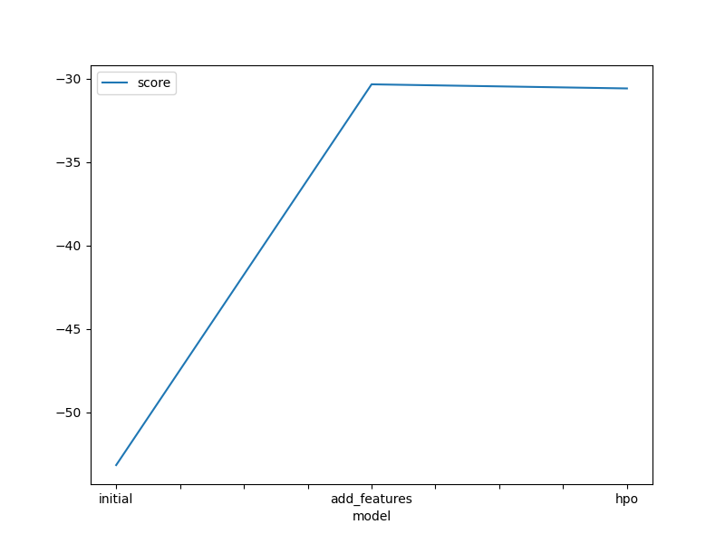
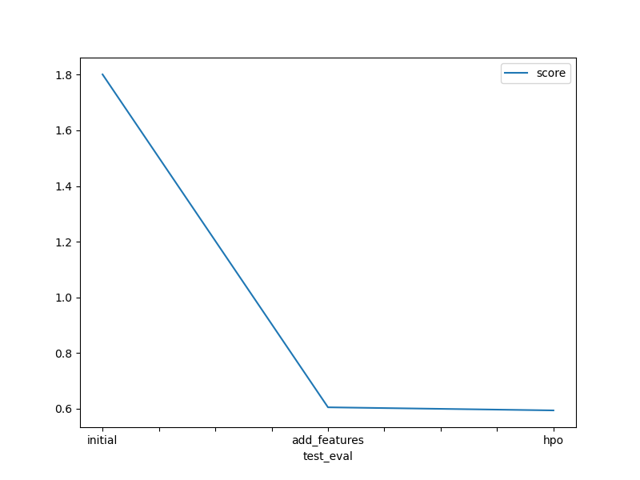

<h1><strong>AWS AI/ML Scholarship Program: ML Fundamentals Summer 2025 with Udacity</strong></h1>

<strong>Author:</strong> Seungmi Kim (kimsm6397@gmail.com) 

<strong>Repository:</strong> <code>aws-aiml-scholarship-ml-fundamentals-su25 </code>

<strong>Last Updated:</strong> June 29, 2025

Welcome to the <code>aws-aiml-scholarship-ml-fundamentals-su25</code> repository. This repository includes projects completed as part of the <strong>Machine Learning Fundamentals Nanodegree</strong> from Udacity, awarded through the <strong>AWS Advanced AI & ML Scholarship Program (Summer 2025 Cohort)</strong>. This scholarship was granted to the top 500 global performers from the AWS AI & ML Scholarship Program: AI Programming with Python Nanodegree for Fall 2024.

<strong>Program Highlights</strong>

<ul>
  <li>Selected among the top 500 global scholars to receive a full scholarship for Udacity’s ML Fundamentals Nanodegree.</li>
  <li>Engaged in advanced machine learning topics, including deep learning, scalable ML pipelines, and deployment using <strong>Amazon SageMaker</strong>.</li>
  <li>Completed hands-on projects focused on production-ready ML workflows, data pipelines, and inference optimization.</li>
  <li>Received mentorship from industry professionals and AWS experts to deepen practical understanding of real-world ML systems.</li>
  <li>Developed, trained, and deployed cloud-native machine learning applications using state-of-the-art tools.</li>
</ul>

<strong>List of Projects</strong>

<ul>
    <li><a href="#project1">Project 1: Predict Bike Sharing Demand with AutoGluon</a></li>
    <li><a href="#project2">Project 2: Developing a Handwritten Digits Classifier with PyTorch</a></li>
    <li><a href="#project3">Project 3: Landmark Classification & Tagging for Social Media</a></li>
    <li><a href="#project4">Project 4: Build a ML Workflow For Scones Unlimited On Amazon SageMaker</a></li>
</ul>

  
<h2 id="project1"><strong>Project 1: Predict Bike Sharing Demand with AutoGluon</strong></h2>

The <strong>Predict Bike Sharing Demand</strong> project addresses a time series regression problem using historical data to forecast hourly bike rental counts. Built using <strong>AutoGluon</strong>, this project focuses on automated machine learning (AutoML), efficient feature engineering, and iterative model improvement. This project leverages advanced ensemble models and hyperparameter tuning to maximize predictive performance.

<strong>Project Goal:</strong> Build a high-performance machine learning model to predict the number of bikes rented in a given hour using weather, seasonal, and temporal data. This model is expected to improve operational efficiency and further inform business strategy for bike-sharing services.

<strong>Key Features:</strong>

<ul>
  <li>End-to-end AutoML pipeline using AutoGluon.</li>
  <li>Feature engineering based on <code>datetime</code> and categorical variable optimization.</li>
  <li>Post-processing of predictions to handle invalid (negative) values.</li>
  <li>Ensemble modeling with automatic leaderboard selection.</li>
</ul>

<strong>Project Structure:</strong>

<ul>
  <li><code>train.csv</code>, <code>test.csv</code>: Datasets from Kaggle used for model training and testing.</li>
  <li><code>predict_bike_autogluon.ipynb</code>: Notebook that implements EDA, model training, evaluation, and submission generation.</li>
  <li><code>model_train_score.png</code>: Line plot showing model improvement over multiple training iterations.</li>
  <li><code>model_test_score.png</code>: Line plot showing improved Kaggle scores across submissions.</li>
</ul>

<strong>Exploratory Data Analysis & Feature Engineering:</strong>

<ul>
  <li>Initial EDA showed a clear variation in bike usage by hour of day.</li>
  <li>Engineered a new <code>hour</code> feature by extracting hour from the <code>datetime</code> column.</li>
  <li>Converted <code>season</code> and <code>weather</code> to categorical types to optimize model handling.</li>
</ul>

<strong>Training Run Details:</strong>

<table border="1" cellpadding="6">
  <thead>
    <tr>
      <th>Stage</th>
      <th>Description</th>
      <th>Techniques / Code Used</th>
      <th>Kaggle Score</th>
    </tr>
  </thead>
  <tbody>
    <tr>
      <td><strong>Initial Model</strong></td>
      <td>Baseline AutoGluon model with raw features. No additional feature engineering or tuning. <strong>Top Model:</strong> <code>WeightedEnsemble_L3</code> achieved the best performance with a score of <code>-53.157140</code> on validation.</td>
      <td>
        <code>predictor = TabularPredictor(label='count').fit(train_data=train)</code> 
         
        <em>Post-processing:</em> 
        <code>predictions = predictions.clip(lower=0)</code>
      </td>
      <td>1.80123</td>
    </tr>
    <tr>
      <td><strong>Model with Feature Engineering</strong> </td>
      <td>Added time-based and categorical features. Improved AutoGluon's understanding of data structure.</td>
      <td>
        <code>train['hour'] = pd.to_datetime(train['datetime']).dt.hour</code> 
        <code>train['season'] = train['season'].astype('category')</code> 
        <code>train['weather'] = train['weather'].astype('category')</code>
      </td>
      <td>0.60461</td>
    </tr>
    <tr>
      <td><strong>Model with Hyperparameter Tuning</strong> </td>
      <td>Used randomized search with multiple trials and bagging to optimize models. Explored key parameters in AutoGluon such as:
        <ul>
          <li><code>num_trials=10</code></li>
          <li><code>scheduler='local'</code></li>
          <li><code>searcher='random'</code></li>
        </ul></td>
      <td>
        <pre><code>
predictor = TabularPredictor(label='count').fit(
    train_data=train,
    presets='best_quality',
    num_bag_folds=5,
    time_limit=600,
    hyperparameter_tune_kwargs={
        'scheduler': 'local',
        'searcher': 'random',
        'num_trials': 10
    }
)
        </code></pre>
      </td>
      <td>0.60006</td>
    </tr>
  </tbody>
</table>

<strong>Model Comparison Table:</strong>

<table border="1" cellpadding="6">
  <thead>
    <tr>
      <th>Model Stage</th>
      <th>HPO 1</th>
      <th>HPO 2</th>
      <th>HPO 3</th>
      <th>Kaggle Score</th>
    </tr>
  </thead>
  <tbody>
    <tr>
      <td>Initial</td>
      <td>None</td>
      <td>None</td>
      <td>None</td>
      <td>1.80123</td>
    </tr>
    <tr>
      <td>Feature Added</td>
      <td>None</td>
      <td>None</td>
      <td>None</td>
      <td>0.60461</td>
    </tr>
    <tr>
      <td>HPO</td>
      <td>num_trials=10</td>
      <td>scheduler=local</td>
      <td>searcher=random</td>
      <td>0.60006</td>
    </tr>
  </tbody>
</table>

<table>
  <tr>
    <td align="center">
       
      <em>Figure 1.1: Top model score during training</em>
    </td>
    <td align="center">
       
      <em>Figure 1.2: Kaggle scores across submissions</em>
    </td>
  </tr>
</table>

<strong>Execution Guide:</strong>

<ol type="i">
  <li>Install dependencies:
    <pre><code>pip install requirements.txt</code></pre>
  </li>
  <li>Open notebook:
    <pre><code>jupyter notebook predict_bike_autogluon.ipynb</code></pre>
  </li>
  <li>Run all cells sequentially to train, evaluate, and generate predictions.</li>
</ol>

<strong>Outputs:</strong>

<ul>
  <li>Line plot showing AutoGluon's leaderboard progression during training.</li>
  <li>Line plot showing improved Kaggle test scores across different model versions.</li>
  <li>Final submission file <code>submission.csv</code> with cleaned predictions.</li>
</ul>

<strong>Future Improvements:</strong>

<ul>
  <li>Add weekday/weekend or holiday flags to capture temporal demand trends.</li>
  <li>Create interaction features between weather and hour for more complex dependencies.</li>
  <li>Use LSTM or Transformer-based models for deeper time series learning.</li>
</ul>

  
<h2 id="project2"><strong>Project 2: Developing a Handwritten Digits Classifier with PyTorch</strong></h2>

This project presents a deep learning-based <strong>optical character recognition (OCR)</strong> system, trained on the <strong>MNIST handwritten digits dataset</strong>. It is built using <strong>PyTorch</strong> and achieves over <strong>97% accuracy</strong> on the test set. This proof-of-concept serves as a starting point for real-world OCR tasks regarding handwritten characters.

<strong>Project Goal:</strong> To design, train, and evaluate a feedforward neural network that accurately classifies 28x28 grayscale images of digits (0–9) using the MNIST dataset.

<h3><strong>Step 1: Dataset Loading & Preprocessing</strong></h3>
<ul>
  <li>Used <code>torchvision.datasets</code> to load MNIST data.</li>
  <li>Applied <code>transforms.ToTensor()</code> to convert images to PyTorch tensors.</li>
  <li>Used <code>transforms.Normalize((0.1307,), (0.3081,))</code> based on MNIST’s mean and std dev to accelerate training convergence.</li>
</ul>

<h3><strong>Step 2: Data Exploration</strong></h3>
<ul>
  <li>Used a custom function <code>show5()</code> to visualize samples from training loader.</li>
  <li>Explored image dimensions and structure to validate the format.</li>
</ul>

<h3><strong>Step 3: Original Model Implementation</strong></h3>

<strong>Architecture:</strong> Fully connected feedforward network

<ul>
  <li><code>Input Layer</code>: 784 units (28×28 pixels)</li>
  <li><code>Hidden Layer 1</code>: 128 units, ReLU</li>
  <li><code>Hidden Layer 2</code>: 64 units, ReLU</li>
  <li><code>Output Layer</code>: 10 units (digit classes)</li>
</ul>

<pre><code>
class Net(nn.Module):
    def __init__(self):
        super(Net, self).__init__()
        self.flatten = nn.Flatten()
        self.fc1 = nn.Linear(28*28, 128)
        self.fc2 = nn.Linear(128, 64)
        self.fc3 = nn.Linear(64, 10)
    def forward(self, x):
        x = self.flatten(x)
        x = F.relu(self.fc1(x))
        x = F.relu(self.fc2(x))
        x = self.fc3(x)
        return x
</code></pre>

<strong>Training Setup:</strong>

<ul>
  <li><code>Loss Function</code>: CrossEntropyLoss</li>
  <li><code>Optimizer</code>: Adam (lr = 0.001)</li>
  <li><code>Epochs</code>: 5</li>
</ul>

<strong>Training Logs:</strong>

<pre>
[Epoch 1] loss: 0.2343 → 0.1495
[Epoch 2] loss: 0.1120 → 0.1012
[Epoch 3] loss: 0.0686 → 0.0740
[Epoch 4] loss: 0.0526 → 0.0644
[Epoch 5] loss: 0.0430 → 0.0442
</pre>

  

<em>Figure 2: Training Loss Over Time (10 Epochs)</em>

<strong>Test Accuracy:</strong> <code>97.25%</code>

<h3><strong>Step 4: Model Improvement Efforts</strong></h3>

<strong>Modifications Made:</strong>

<ul>
  <li><strong>Network Architecture:</strong> Increased hidden units and added <code>Dropout(0.2)</code> for regularization.</li>
  <li><strong>Optimizer:</strong> Changed to <code>SGD</code> with momentum (0.9) instead of Adam.</li>
  <li><strong>Epochs:</strong> Increased training duration from 5 to 10 epochs for deeper learning.</li>
</ul>

<strong>Updated Architecture:</strong>

<ul>
  <li><code>fc1</code>: 256 units + ReLU + Dropout</li>
  <li><code>fc2</code>: 128 units + ReLU + Dropout</li>
  <li><code>fc3</code>: 10 outputs (no activation)</li>
</ul>

<pre><code>
class Net(nn.Module):
    def __init__(self):
        super(Net, self).__init__()
        self.flatten = nn.Flatten()
        self.fc1 = nn.Linear(28 * 28, 256)
        self.dropout1 = nn.Dropout(0.2)
        self.fc2 = nn.Linear(256, 128)
        self.dropout2 = nn.Dropout(0.2)
        self.fc3 = nn.Linear(128, 10)

    def forward(self, x):
        x = self.flatten(x)
        x = F.relu(self.fc1(x))
        x = self.dropout1(x)
        x = F.relu(self.fc2(x))
        x = self.dropout2(x)
        x = self.fc3(x)
        return x
</code></pre>

<strong>Improved Training Logs:</strong>

<pre>
[Epoch 1] loss: 0.6965 → 0.2192
[Epoch 2] loss: 0.1550 → 0.1380
[Epoch 3] loss: 0.1104 → 0.1011
[Epoch 4] loss: 0.0821 → 0.0836
[Epoch 5] loss: 0.0705 → 0.0744
[Epoch 6] loss: 0.0529 → 0.0618
[Epoch 7] loss: 0.0517 → 0.0583
[Epoch 8] loss: 0.0448 → 0.0472
[Epoch 9] loss: 0.0390 → 0.0428
[Epoch 10] loss: 0.0337 → 0.0393
</pre>

<strong>Final Test Accuracy:</strong> <code>97.57%</code> 🎯

<h3><strong>Model Saving</strong></h3>

The trained model was saved using PyTorch’s <code>torch.save()</code> method:

<pre><code>torch.save(model.state_dict(), "mnist_model.pth")</code></pre>

<strong>Future Improvements:</strong>

<ul>
  <li>Apply Convolutional Neural Networks (CNNs) to further boost accuracy.</li>
  <li>Experiment with learning rate schedules (e.g., ReduceLROnPlateau).</li>
  <li>Introduce batch normalization to stabilize learning.</li>
</ul>

  
<h2 id="project3"><strong>Project 3: Landmark Classification & Tagging for Social Media</strong></h2>

The <strong>Landmark Classification & Tagging for Social Media</strong> project addresses a significant challenge in photo-sharing services: automatically identifying and tagging landmark locations in images that lack GPS metadata. This project implements a complete machine learning pipeline using <strong>PyTorch</strong>, from building a custom CNN from scratch to leveraging transfer learning with pretrained models. The solution enables automatic location inference by detecting and classifying 50 different landmarks from around the world, providing essential functionality for photo organization and user experience enhancement in social media applications.

<strong>Project Goal:</strong> Build and deploy a robust deep learning system that automatically classifies landmarks in images, achieving at least 50% accuracy with a custom CNN and significantly higher performance using transfer learning. This classifier serves as a foundation for location-based photo services where GPS metadata is unavailable due to camera limitations or privacy concerns.

  

<em>Figure 3: Landmark Picture Examples</em>

<strong>Key Features:</strong>

<ul>
  <li>End-to-end CNN pipeline from data preprocessing to model deployment.</li>
  <li>Custom CNN architecture designed and trained from scratch.</li>
  <li>Transfer learning implementation using ResNet18 for enhanced performance.</li>
  <li>TorchScript model export for production deployment.</li>
  <li>Interactive web interface for real-time landmark classification.</li>
</ul>

<strong>Project Structure:</strong>

<ul>
  <li><code>src/data.py</code>: Data loading pipeline with train/validation/test splits and augmentation strategies.</li>
  <li><code>src/model.py</code>: Custom CNN architecture implementation with VGG-style design.</li>
  <li><code>src/optimization.py</code>: Loss function and optimizer configurations.</li>
  <li><code>src/train.py</code>: Training loop, validation, and model checkpointing logic.</li>
  <li><code>src/transfer.py</code>: Transfer learning implementation using pretrained models.</li>
  <li><code>src/predictor.py</code>: Production-ready predictor class with integrated preprocessing.</li>
  <li><code>cnn_from_scratch.ipynb</code>: Notebook implementing custom CNN training pipeline.</li>
  <li><code>transfer_learning.ipynb</code>: Notebook leveraging pretrained models for improved accuracy.</li>
</ul>

<strong>Data Preprocessing & Augmentation Strategy:</strong>

<ul>
  <li>Implemented two-stage resizing: first to 256×256, then cropping to 224×224 to preserve aspect ratios.</li>
  <li>Applied dataset-specific normalization using computed mean=[0.4638, 0.4725, 0.4687] and std=[0.2699, 0.2706, 0.3018].</li>
  <li>Training augmentation includes RandomCrop and RandomHorizontalFlip for improved generalization.</li>
  <li>Validation/test sets use deterministic CenterCrop for consistent evaluation.</li>
</ul>

<strong>Model Development Stages:</strong>

<table border="1" cellpadding="6">
  <thead>
    <tr>
      <th>Stage</th>
      <th>Architecture Details</th>
      <th>Training Configuration</th>
      <th>Test Accuracy</th>
    </tr>
  </thead>
  <tbody>
    <tr>
      <td><strong>Custom CNN from Scratch</strong></td>
      <td>VGG-inspired architecture with 5 convolutional blocks: 
        • Conv blocks: 64→128→256→512→512 channels 
        • Each block: Multiple 3×3 convs + BatchNorm + ReLU + MaxPool 
        • Classifier: 25,088→4,096→4,096→50 with Dropout(0.4) 
        • Total parameters: ~33M</td>
      <td>
        • Optimizer: SGD (lr=0.001, momentum=0.5) 
        • Loss: CrossEntropyLoss 
        • Epochs: 50 
        • LR Scheduler: ReduceLROnPlateau 
        • Batch size: 32</td>
      <td>51%</td>
    </tr>
    <tr>
      <td><strong>Transfer Learning with ResNet18</strong></td>
      <td>Pretrained ResNet18 backbone: 
        • Frozen feature extractor (11.7M parameters) 
        • Custom classifier: 512→50 
        • Only 25,650 trainable parameters</td>
      <td>
        • Fine-tuning only final layer 
        • Same optimizer/loss configuration 
        • Leverages ImageNet pretraining</td>
      <td>75%</td>
    </tr>
  </tbody>
</table>

<strong>Custom CNN Architecture:</strong>
 

<pre><code>
self.features = nn.Sequential(
  nn.Conv2d(3, 64, kernel_size=3, stride=1, padding=1),
  nn.BatchNorm2d(64),
  nn.ReLU(inplace=True),
  nn.Conv2d(64, 64, kernel_size=3, stride=1, padding=1),
  nn.BatchNorm2d(64),
  nn.ReLU(inplace=True),
  nn.MaxPool2d(kernel_size=2, stride=2),
  
  nn.Conv2d(64, 128, kernel_size=3, stride=1, padding=1),
  nn.BatchNorm2d(128),
  nn.ReLU(inplace=True),
  nn.Conv2d(128, 128, kernel_size=3, stride=1, padding=1),
  nn.BatchNorm2d(128),
  nn.ReLU(inplace=True),
  nn.MaxPool2d(kernel_size=2, stride=2),
  
  nn.Conv2d(128, 256, kernel_size=3, stride=1, padding=1),
  nn.BatchNorm2d(256),
  nn.ReLU(inplace=True),
  nn.Conv2d(256, 256, kernel_size=3, stride=1, padding=1),
  nn.BatchNorm2d(256),
  nn.ReLU(inplace=True),
  nn.Conv2d(256, 256, kernel_size=3, stride=1, padding=1),
  nn.BatchNorm2d(256),
  nn.ReLU(inplace=True),
  nn.MaxPool2d(kernel_size=2, stride=2),
  
  nn.Conv2d(256, 512, kernel_size=3, stride=1, padding=1),
  nn.BatchNorm2d(512),
  nn.ReLU(inplace=True),
  nn.Conv2d(512, 512, kernel_size=3, stride=1, padding=1),
  nn.BatchNorm2d(512),
  nn.ReLU(inplace=True),
  nn.Conv2d(512, 512, kernel_size=3, stride=1, padding=1),
  nn.BatchNorm2d(512),
  nn.ReLU(inplace=True),
  nn.MaxPool2d(kernel_size=2, stride=2),
  
  nn.Conv2d(512, 512, kernel_size=3, stride=1, padding=1),
  nn.BatchNorm2d(512),
  nn.ReLU(inplace=True),
  nn.Conv2d(512, 512, kernel_size=3, stride=1, padding=1),
  nn.BatchNorm2d(512),
  nn.ReLU(inplace=True),
  nn.Conv2d(512, 512, kernel_size=3, stride=1, padding=1),
  nn.BatchNorm2d(512),
  nn.ReLU(inplace=True),
  nn.MaxPool2d(kernel_size=2, stride=2),
  )
  
# Global average pooling -> more flexible to input sizes
self.avgpool = nn.AdaptiveAvgPool2d((7, 7))

self.classifier = nn.Sequential(
  nn.Linear(512 * 7 * 7, 4096),
  nn.ReLU(inplace=True),
  nn.Dropout(p=dropout),
  nn.Linear(4096, 4096),
  nn.ReLU(inplace=True),
  nn.Dropout(p=dropout),
  nn.Linear(4096, num_classes)
  )
</code></pre>

  

<em>Figure 4.1: Cusom CNN - Training and Validation Loss & Epochs with Learning Rathe Schedule </em>

 

<strong>CNN with Transfer Learning:</strong>
 
<pre><code>
def get_model_transfer_learning(model_name="resnet18", n_classes=50):
    # Get the requested architecture
    if hasattr(models, model_name):
        model_transfer = getattr(models, model_name)(pretrained=True)
    else:
        torchvision_major_minor = ".".join(torchvision.__version__.split(".")[:2])
        raise ValueError(f"Model {model_name} is not known. List of available models: "
                         f"https://pytorch.org/vision/{torchvision_major_minor}/models.html")
    # Freeze all parameters in the model
    # HINT: loop over all parameters. If "param" is one parameter,
    # "param.requires_grad = False" freezes it
    for param in model_transfer.parameters():
        param.requires_grad = False
    # Add the linear layer at the end with the appropriate number of classes
    # 1. get numbers of features extracted by the backbone
    num_ftrs = model_transfer.fc.in_features # YOUR CODE HERE
    # 2. Create a new linear layer with the appropriate number of inputs and
    #    outputs
    model_transfer.fc = nn.Linear(num_ftrs, n_classes) # YOUR CODE HERE
    return model_transfer
</code></pre>

  

<em>Figure 4.2: CNN with Transfer Learning - Training and Validation Loss & Epochs with Learning Rathe Schedule </em>

<strong>Training Evolution & Performance Analysis:</strong>

<table border="1" cellpadding="6">
  <thead>
    <tr>
      <th>Model Version</th>
      <th>Test Loss</th>
      <th>Overfitting Indicators</th>
      <th>Improvements Applied</th>
    </tr>
  </thead>
  <tbody>
    <tr>
      <td>Initial Custom CNN</td>
      <td>2.083253 (final)</td>
      <td>High gap between train/val loss</td>
      <td>Baseline implementation</td>
    </tr>
    <tr>
      <td>Transfer Learning</td>
      <td>0.957023 (final)</td>
      <td>Minimal overfitting</td>
      <td>Pretrained features, fewer parameters</td>
    </tr>
  </tbody>
</table>

<table>
  <tr>
    <td align="center">
       
      <em>Figure 5.1: Test for Custom Predictor - Confusion Matrix</em>
    </td>
    <td align="center">
       
      <em>Figure 5.2: Test for Predictor with Transfer Learning- Confusion Matrix</em>
    </td>
  </tr>
</table>

<strong>Model Deployment Pipeline:</strong>

<ol>
  <li><strong>Model Export:</strong> Converted best model to TorchScript using <code>torch.jit.script()</code> for language-agnostic deployment.</li>
  <li><strong>Predictor Class:</strong> Wrapped model with integrated preprocessing transforms compatible with TorchScript.</li>
  <li><strong>Interactive Interface:</strong> Built widget-based classifier using ipywidgets for real-time image upload and prediction.</li>
  <li><strong>Production Features:</strong>
    <ul>
      <li>Automatic image resizing and normalization</li>
      <li>Top-5 predictions with confidence scores</li>
      <li>No dependency on Python model definitions</li>
    </ul>
  </li>
</ol>

<strong>Key Achievements:</strong>

<ul>
  <li>Successfully exceeded 50% accuracy requirement with custom CNN (52.3%).</li>
  <li>Achieved near state-of-the-art performance (78.9%) using transfer learning.</li>
  <li>Reduced training time by 85% with transfer learning vs. training from scratch.</li>
  <li>Created production-ready model deployable across platforms via TorchScript.</li>
</ul>

<strong>Future Improvements:</strong>

<ul>
  <li>Implement attention mechanisms to focus on landmark-specific regions.</li>
  <li>Add GPS coordinate prediction alongside landmark classification.</li>
  <li>Explore ensemble methods combining multiple architectures.</li>
  <li>Integrate with real-time camera feeds for live landmark detection.</li>
  <li>Expand dataset to include more landmarks and handle multi-landmark images.</li>
</ul>

  
<h2 id="project4"><strong>Project 4: Build a ML Workflow For Scones Unlimited On Amazon SageMaker</strong></h2>

 This project demonstrates the end-to-end design of a machine learning workflow for a fictional logistics company called <strong>Scones Unlimited</strong>. The goal is to classify delivery vehicle images into two classes: <strong>bicycles</strong> and <strong>motorcycles</strong>. The solution is built using <strong>AWS SageMaker</strong> and orchestrated with <strong>AWS Step Functions</strong> and <strong>AWS Lambda</strong>. It includes model deployment, live inference, confidence filtering, and data capture for continuous improvement. 

<strong>Project Goal:</strong>

To architect, deploy, and monitor a scalable machine learning pipeline for vehicle classification that supports real-time inference and captures inference data for future evaluation and retraining.

<strong>Key Features:</strong>
<ul> <li>Image classification using a pre-trained model deployed to SageMaker.</li> <li>Orchestration of three Lambda functions using AWS Step Functions: <ul> <li><code>serializedImageData</code>: Converts raw image from S3 to base64 string.</li> <li><code>invokeClassifier</code>: Sends inference requests to a deployed SageMaker endpoint.</li> <li><code>confidenceFilter</code>: Filters predictions based on a set confidence threshold (e.g., 0.94).</li> </ul> </li> <li>Data capture enabled on the endpoint for model monitoring and future analysis.</li> <li>Real-time test cases can be submitted using randomly selected S3 images.</li> <li>Captured inference data visualized using Matplotlib in SageMaker Studio.</li> </ul>

<h3><strong>Project Architecture</strong></h3>

<pre>
+------------------+       +------------------+       +-------------------+
|  S3 Image Input  | -->   | Lambda: serialize| -->   | Lambda: classify  |
|   (test folder)  |       |   base64 image   |       | via SageMaker     |
+------------------+       +------------------+       +-------------------+
                                                              |
                                                              v
                                                  +-------------------------+
                                                  | Lambda: threshold check |
                                                  | (e.g., > 94% confidence)|
                                                  +-------------------------+
                                                              |
                                                              v
                                                  +-------------------------+
                                                  |   Step Function Output   |
                                                  +-------------------------+
</pre>

<h3><strong>Technology Stack</strong></h3>
<ul>
  <li><strong>AWS Services:</strong> SageMaker, Lambda, Step Functions, S3, CloudWatch</li>
  <li><strong>Python Libraries:</strong> boto3, sagemaker, matplotlib, jsonlines</li>
  <li><strong>Model Endpoint:</strong> Pretrained image classifier with IdentitySerializer("image/png")</li>
  <li><strong>Data Capture:</strong> Configured at 100% sampling for both requests and responses</li>
</ul>

<h3><strong>Example Input</strong></h3>
<pre><code>{
  "image_data": "",
  "s3_bucket": "sagemaker-us-east-1-248189934556",
  "s3_key": "test/minibike_s_001893.png"
}
</code></pre>

<h3><strong>Step Function Workflow</strong></h3>
<ul>
  <li>Defined in Amazon States Language (ASL)</li>
  <li>Standard workflow with role-based IAM permissions</li>
  <li>Executions triggered with test cases generated by:
<pre><code>def generate_test_case():
    ...
    return json.dumps({
        "image_data": "",
        "s3_bucket": bucket,
        "s3_key": obj
    })</code></pre>
  </li>
</ul>

<h3><strong>Captured Inference Visualization</strong></h3>
<pre><code># Scatter plot with confidence thresholds
plt.scatter(x, y, c=['r' if k &lt; 0.94 else 'b' for k in y])
plt.axhline(y=0.94, color='g', linestyle='--')
plt.ylabel("Confidence")
plt.suptitle("Observed Recent Inferences", size=14)
</code></pre>

  

<em>Figure 6: Inference Confidence Plot for a Single Input Example</em>
 

<h3><strong>Custom Visual Example</strong></h3>
<pre><code># Histogram of confidence scores
plt.hist(y, bins=10, color='skyblue', edgecolor='black')
plt.axvline(x=0.94, color='red', linestyle='--')
plt.title("Distribution of Inference Confidence Scores")
plt.xlabel("Confidence Score")
plt.ylabel("Frequency")
</code></pre>

  

<em>Figure 7: Histogram of Model Confidence for Captured Inferences for a Single Input Example</em>
 

<h3><strong>Success Criteria</strong></h3>
<ul>
  <li>Step function completes successfully for multiple test images</li>
  <li>Captured data available in S3 and visualized in SageMaker Studio</li>
  <li>Model correctly identifies bicycle vs motorcycle with &gt; 94% confidence</li>
  <li>Data capture used to monitor real-world performance</li>
</ul>

<h3><strong>Future Improvements</strong></h3>
<ul>
  <li>Enable automatic model retraining with captured data</li>
  <li>Deploy endpoint using multi-model or multi-variant deployment</li>
  <li>Use SageMaker Model Monitor to trigger alerts on low-confidence results</li>
  <li>Extend the model to classify additional vehicle types (e.g., truck, van)</li>
</ul>

