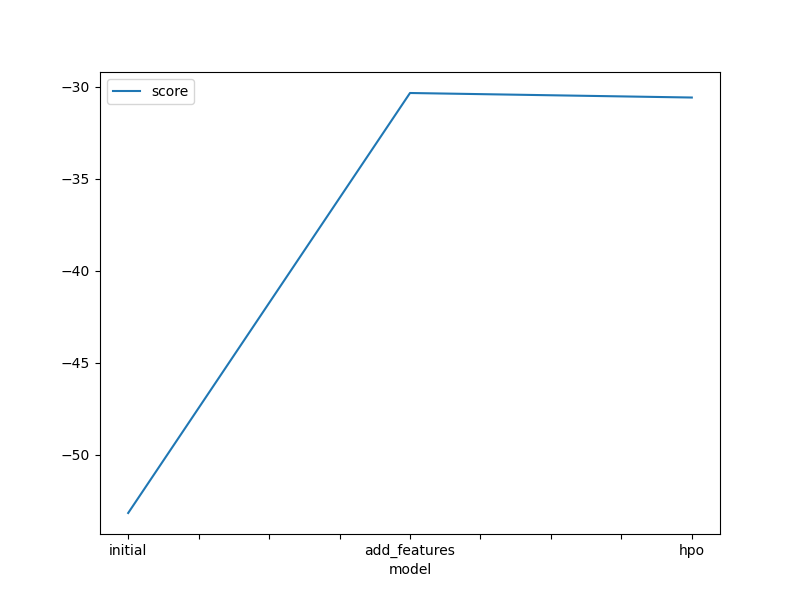
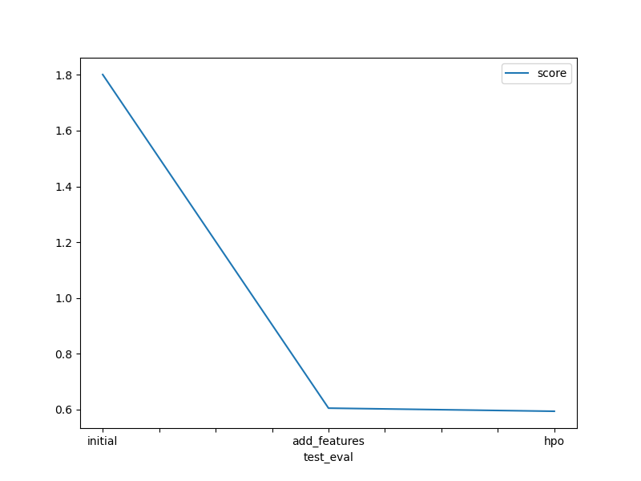

<h1><strong>AWS AI/ML Scholarship Program: ML Fundamentals Summer 2025 with Udacity</strong></h1>

<strong>Author:</strong> Seungmi Kim (kimsm6397@gmail.com) 

<strong>Repository:</strong> <code>aws-aiml-scholarship-ml-fundamentals-su25 </code>

<strong>Last Updated:</strong> May 28, 2025

<strong>List of Projects</strong>

<ul>
    <li><a href="#project1">Project 1: Predict Bike Sharing Demand with AutoGluon</a></li>
    <li><a href="#project2">Project 2: </a></li>
    <li><a href="#project3">Project 3: </a></li>
    <li><a href="#project4">Project 4: </a></li>
</ul>

  
<h2 id="project1"><strong>Project 1: Predict Bike Sharing Demand with AutoGluon</strong></h2>

The <strong>Predict Bike Sharing Demand</strong> project addresses a time series regression problem using historical data to forecast hourly bike rental counts. Built using <strong>AutoGluon</strong>, this project focuses on automated machine learning (AutoML), efficient feature engineering, and iterative model improvement. This project leverages advanced ensemble models and hyperparameter tuning to maximize predictive performance.

<strong>Project Goal:</strong> Build a high-performance machine learning model to predict the number of bikes rented in a given hour using weather, seasonal, and temporal data. This model is expected to improve operational efficiency and further inform business strategy for bike-sharing services.

<strong>Key Features:</strong>

<ul>
  <li>End-to-end AutoML pipeline using AutoGluon.</li>
  <li>Feature engineering based on <code>datetime</code> and categorical variable optimization.</li>
  <li>Post-processing of predictions to handle invalid (negative) values.</li>
  <li>Ensemble modeling with automatic leaderboard selection.</li>
</ul>

<strong>Project Structure:</strong>

<ul>
  <li><code>train.csv</code>, <code>test.csv</code>: Datasets from Kaggle used for model training and testing.</li>
  <li><code>predict_bike_autogluon.ipynb</code>: Notebook that implements EDA, model training, evaluation, and submission generation.</li>
  <li><code>model_train_score.png</code>: Line plot showing model improvement over multiple training iterations.</li>
  <li><code>model_test_score.png</code>: Line plot showing improved Kaggle scores across submissions.</li>
</ul>

<strong>Exploratory Data Analysis & Feature Engineering:</strong>

<ul>
  <li>Initial EDA showed a clear variation in bike usage by hour of day.</li>
  <li>Engineered a new <code>hour</code> feature by extracting hour from the <code>datetime</code> column.</li>
  <li>Converted <code>season</code> and <code>weather</code> to categorical types to optimize model handling.</li>
</ul>

<strong>Training Run Details:</strong>

<table border="1" cellpadding="6">
  <thead>
    <tr>
      <th>Stage</th>
      <th>Description</th>
      <th>Techniques / Code Used</th>
      <th>Kaggle Score</th>
    </tr>
  </thead>
  <tbody>
    <tr>
      <td><strong>Initial Model</strong></td>
      <td>Baseline AutoGluon model with raw features. No additional feature engineering or tuning. <strong>Top Model:</strong> <code>WeightedEnsemble_L3</code> achieved the best performance with a score of <code>-53.157140</code> on validation.</td>
      <td>
        <code>predictor = TabularPredictor(label='count').fit(train_data=train)</code> 
         
        <em>Post-processing:</em> 
        <code>predictions = predictions.clip(lower=0)</code>
      </td>
      <td>1.80123</td>
    </tr>
    <tr>
      <td><strong>Model with Feature Engineering</strong> </td>
      <td>Added time-based and categorical features. Improved AutoGluon's understanding of data structure.</td>
      <td>
        <code>train['hour'] = pd.to_datetime(train['datetime']).dt.hour</code> 
        <code>train['season'] = train['season'].astype('category')</code> 
        <code>train['weather'] = train['weather'].astype('category')</code>
      </td>
      <td>0.60461</td>
    </tr>
    <tr>
      <td><strong>Model with Hyperparameter Tuning</strong> </td>
      <td>Used randomized search with multiple trials and bagging to optimize models. Explored key parameters in AutoGluon such as:
        <ul>
          <li><code>num_trials=10</code></li>
          <li><code>scheduler='local'</code></li>
          <li><code>searcher='random'</code></li>
        </ul></td>
      <td>
        <pre><code>
predictor = TabularPredictor(label='count').fit(
    train_data=train,
    presets='best_quality',
    num_bag_folds=5,
    time_limit=600,
    hyperparameter_tune_kwargs={
        'scheduler': 'local',
        'searcher': 'random',
        'num_trials': 10
    }
)
        </code></pre>
      </td>
      <td>0.60006</td>
    </tr>
  </tbody>
</table>

<strong>Model Comparison Table:</strong>

<table border="1" cellpadding="6">
  <thead>
    <tr>
      <th>Model Stage</th>
      <th>HPO 1</th>
      <th>HPO 2</th>
      <th>HPO 3</th>
      <th>Kaggle Score</th>
    </tr>
  </thead>
  <tbody>
    <tr>
      <td>Initial</td>
      <td>None</td>
      <td>None</td>
      <td>None</td>
      <td>1.80123</td>
    </tr>
    <tr>
      <td>Feature Added</td>
      <td>None</td>
      <td>None</td>
      <td>None</td>
      <td>0.60461</td>
    </tr>
    <tr>
      <td>HPO</td>
      <td>num_trials=10</td>
      <td>scheduler=local</td>
      <td>searcher=random</td>
      <td>0.60006</td>
    </tr>
  </tbody>
</table>

<table>
  <tr>
    <td align="center">
       
      <em>Figure: Top model score during training</em>
    </td>
    <td align="center">
       
      <em>Figure: Kaggle scores across submissions</em>
    </td>
  </tr>
</table>

<strong>Execution Guide:</strong>

<ol type="i">
  <li>Install dependencies:
    <pre><code>pip install requirements.txt</code></pre>
  </li>
  <li>Open notebook:
    <pre><code>jupyter notebook predict_bike_autogluon.ipynb</code></pre>
  </li>
  <li>Run all cells sequentially to train, evaluate, and generate predictions.</li>
</ol>

<strong>Outputs:</strong>

<ul>
  <li>Line plot showing AutoGluon's leaderboard progression during training.</li>
  <li>Line plot showing improved Kaggle test scores across different model versions.</li>
  <li>Final submission file <code>submission.csv</code> with cleaned predictions.</li>
</ul>

<strong>Future Improvements:</strong>

<ul>
  <li>Add weekday/weekend or holiday flags to capture temporal demand trends.</li>
  <li>Create interaction features between weather and hour for more complex dependencies.</li>
  <li>Use LSTM or Transformer-based models for deeper time series learning.</li>
</ul>

